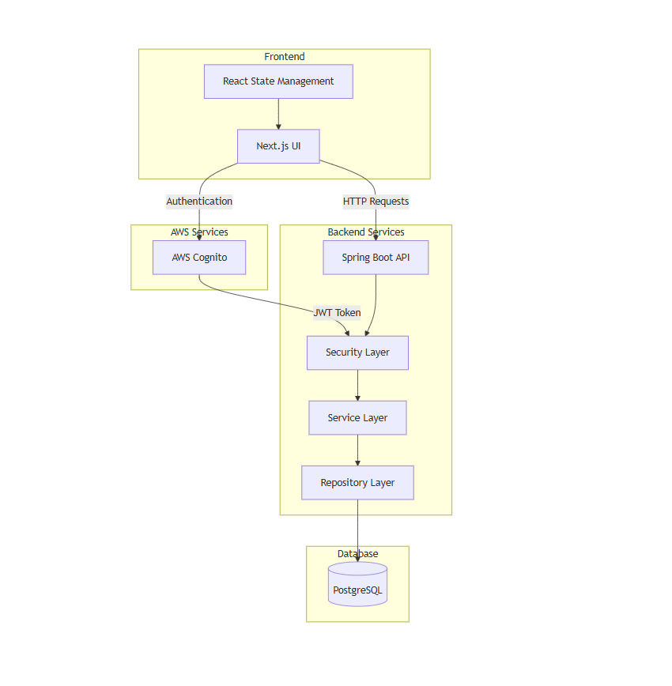
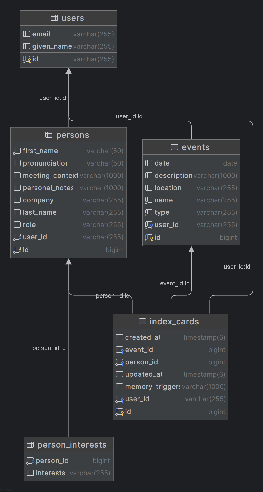
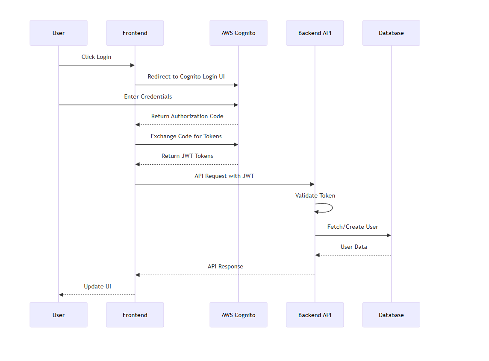
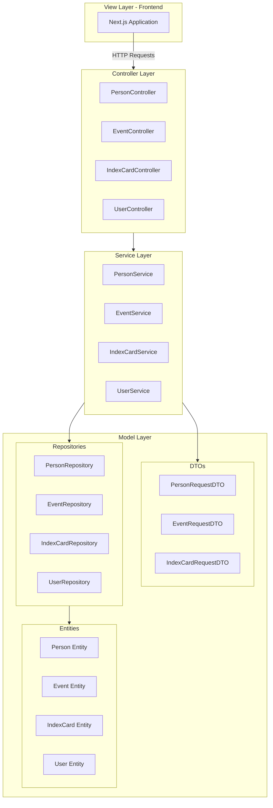

# ReMind

ReMind is a fun web application I designed to help myself remember people that I have met at social events, work functions, and gatherings. Inspired by the historical practice of using index cards for relationship management.
## Background

ReMind was created from a personal challenge that many face: remembering names and details about people we meet. The idea comes from a fascinating historical account of a U.S. president who maintained a system of index cards to track relationships and build meaningful connections. This practice proved invaluable in his journey to the presidency, demonstrating the power of personal relationship management.

## Video Walk through
Youtube: https://youtu.be/E7MglodX8hE

## System Architecture

### High-Level Architecture

The system is built using a modern tech stack:
- Frontend: Next.js
- Backend: Spring Boot
- Database: PostgreSQL
- Authentication: AWS Cognito
- Containerization: Docker

### Database Schema

The database design ensures proper data isolation and relationship management between users, events, persons, and index cards.

### Authentication Flow

The application uses AWS Cognito for secure authentication, implementing the OAuth2 authorization code grant flow.

### MVC Architecture Implementation

## Features

### Core Functionality
- User authentication and authorization
- Event management
- Contact information storage
- Personal notes and memory triggers
- Context preservation for each interaction
- Pre-meeting review functionality

### Technical Features
- Secure user data isolation
- REST API implementation
- Responsive web interface
- Cloud-based authentication
- Data persistence and backup
- Docker containerization

## Implementation Details

### Backend
- Spring Boot REST API
- JPA/Hibernate for data persistence
- DTO pattern for data transfer
- Interface-based service layer
- Global exception handling
- Security configuration for AWS Cognito

### Frontend
- Next.js 15
- React Hooks (useState, useEffect)
- Shadcn Components
- Custom modal components
- Responsive design

### Security
- AWS Cognito integration
- JWT token validation
- Role-based access control
- User data isolation

## Future Enhancements
1. Extended Account Management
   - Profile updating functionality
   - Advanced account settings
   - User preferences

2. Search and Filter Capabilities
   - Advanced search for events
   - People search with filters
   - Tag-based searching

3. Deployment
   - Cloud deployment strategy
   - Production environment setup
   - Performance optimization

## Individual Reflection

During the development of ReMind, I gained valuable experience in several areas:

1. AWS Cognito Integration
   - Implemented OAuth2 authentication flow
   - Handled JWT token validation
   - Managed user sessions and security

2. Technical Growth
   - Deepened understanding of Spring Boot
   - Gained experience with Next.js
   - Learned about secure authentication practices

3. Areas for Improvement
   - Enhanced account management features
   - Implementation of search functionality
   - Application deployment

The project provided hands-on experience with modern web technologies while solving a real-world problem. Future iterations would focus on expanding functionality and improving user experience through additional features and optimizations.

